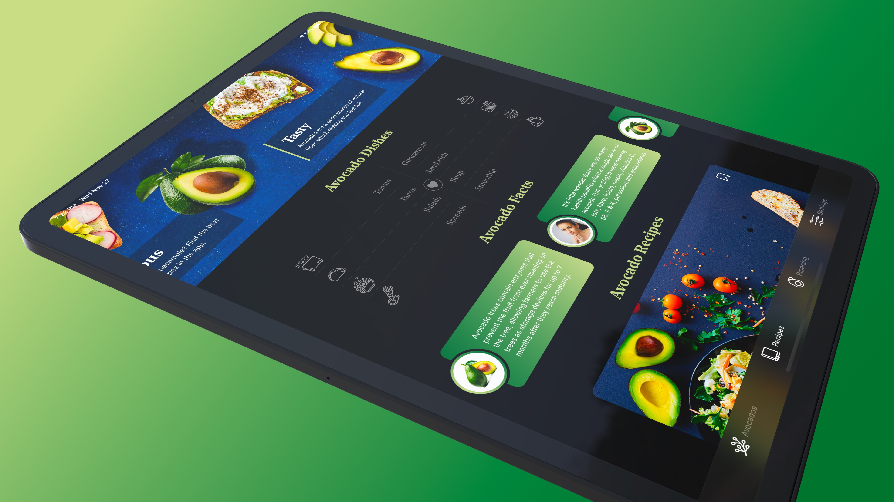
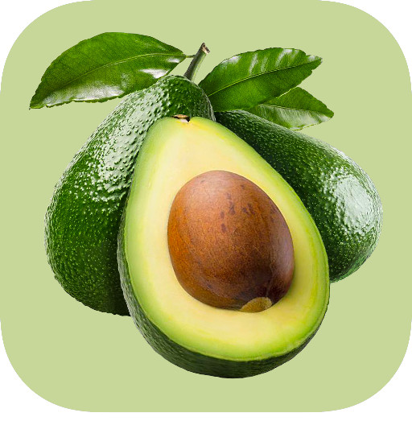

# SwiftUI 2 - Avocados
 

  

## Topics are covered:

- [x] How to create scroll views inside another scroll view,
- [x] Why we should use custom View Modifiers (avoiding code repetition)
- [x] How to build a tab view with custom icons,
- [x] How to master the vertical and horizontal layout design,
- [x] How to round the corners of a view and create a unique shape form,
- [x] How to support the Light/Dark modes in SwiftUI,
- [x] How to create micro animation and enhance the UI,
- [x] A gentle introduction into forms in SwiftUI

## Demo

  
  

    This app is optimized for the iPad as well. With a couple of lines, you can support the wider screens both in landscape and portrait.
  

  
  

    Building a great layout in SwiftUI is a cornerstone of iOS development so we are going to go deep in the following section.
  

  
  

    Avocado App Icon
  

## Meta

Tin Tran – [Linkedin](https://www.linkedin.com/in/realtrantrungtin) – realtrantrungtin@gmail.com
